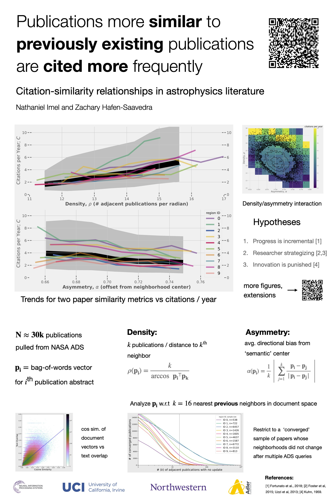

### Poster

### Abstract

We report a novel observation about which scientific publications are cited more frequently: those that are more textually similar to pre-existing publications. Using word-vector based document embeddings, we analyze quantitative trends for a large sample of publication abstracts in the field of astrophysics (N ∼ 300, 000). When new publications are ranked by how many similar publications already exist in their neighborhood, the median number of citations per year that the upper 50th percentile receives is ∼ 1.6× that of the lower 50th percentile. When new publications are ranked by an alternative metric of dissimilarity to neighbors, median citations per year decrease by a factor of ∼ 1.5 from the lower to the upper 50th percentile. We discuss a number of hypotheses that could explain this citation-similarity relationship relevant to the science of science.
