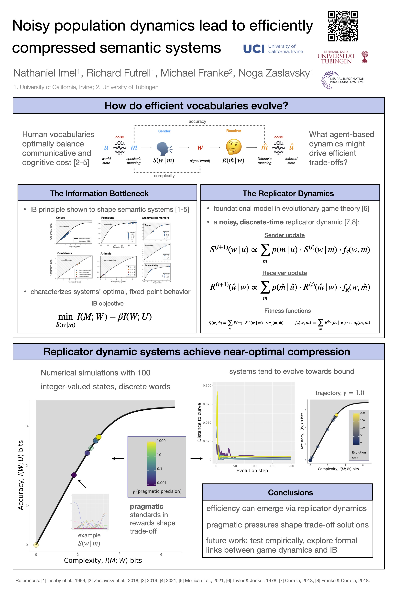

### Poster

### Abstract

Converging cross-linguistic evidence suggests that that human vocabularies are shaped for efficient communication, but we know little about the agent-based dynamics that could explain their evolution. In this paper, we show that very general population dynamics of signaling games lead to the emergence of information-theoretically efficient meaning systems. In numerical simulations, we observe that noisy perception of meaning can result in evolved systems with higher efficiency.
