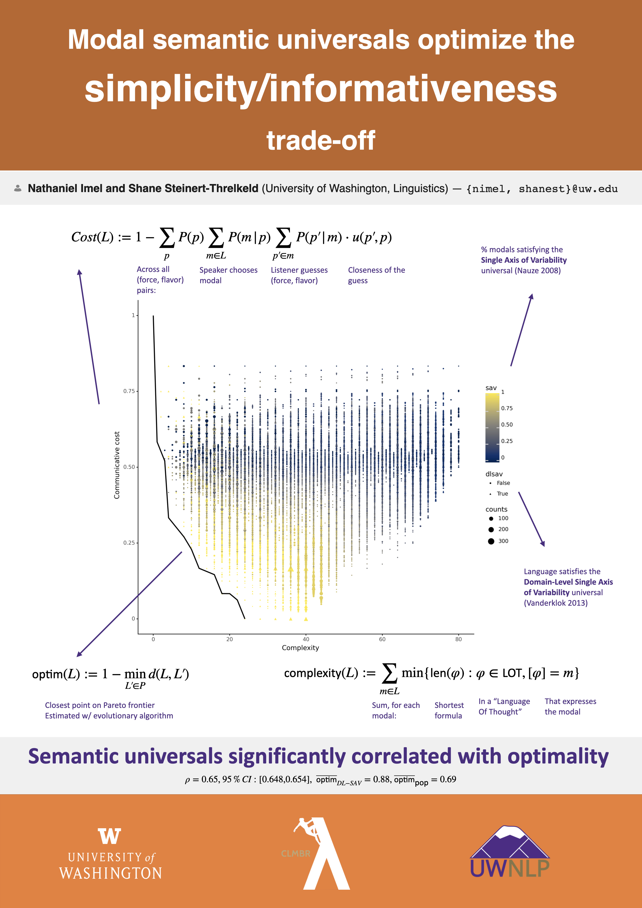

[Paper](https://doi.org/10.3765/salt.v1i0.5346)
[Slides](https://osf.io/gyn3t/)
[Code](https://github.com/nathimel/modals-effcomm)

### Poster

### Abstract

The meanings expressed by the world’s languages have been argued to support efficient communication. Evidence for this hypothesis has drawn on cross-linguistic analyses of vocabulary in semantic domains of both content words (e.g. kinship terms (Kemp & Regier 2012); color terms (Regier, Kay & Khetarpal 2007; Zaslavsky, Kemp, Regier & Tishby 2018)) and function words (e.g. quantifiers (Steinert-Threlkeld 2021); indefinite pronouns (Denic, Steinert-Threlkeld & Szymanik 2022)) approaching the hypothesis concretely in terms of a trade-off between simplicity and informativeness. We apply the analysis to modals (e.g. can, ought, might). Two proposed universals in this domain from Nauze (2008) and Vander Klok (2013) are used for generating many artificial languages with varying degrees of quasi-naturalness as a proxy for natural data. A computational experiment shows that most of the optimal solutions to the trade-off problem are predicted by Vander Klok; meanwhile, as languages more robustly satisfy Nauze’s universal, they also become more optimal. This suggests that efficient communication is a leading explanation for constraints on modal semantic variation.
