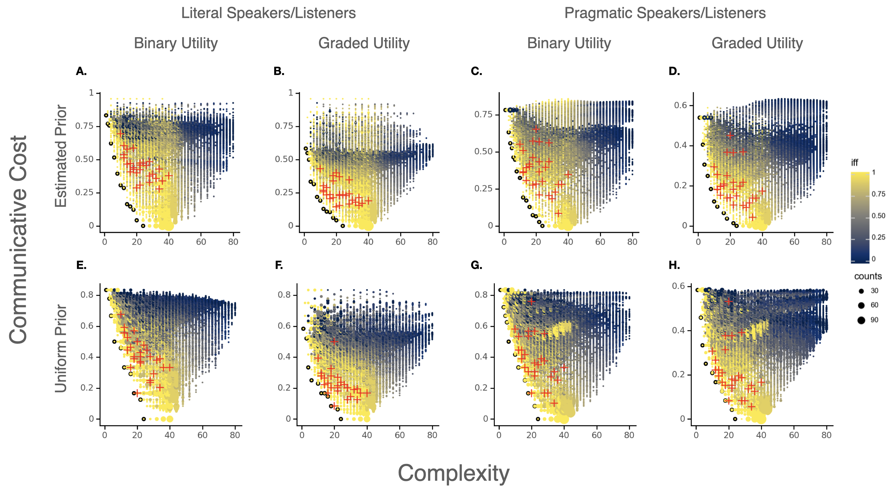

<!-- [Preprint](https://ling.auf.net/lingbuzz/007392) -->
<!-- [Code](https://github.com/nathimel/modals-effcomm) -->

### Abstract

The meanings expressed by the world's languages have been argued to support efficient communication. Across diverse semantic domains, crosslinguistic analyses show that natural language vocabularies are jointly optimized for two competing pressures: cognitive simplicity and informative communication. This paper applies an efficiency analysis to *modals* (e.g. *can*, *ought*, *might*). We define and measure the simplicity and informativeness of a large number of logically possible modal systems, including a sample of twenty seven natural language inventories. We also consider a recently-introduced semantic universal for modal expressions in natural language, dubbed the Independence of Force and Flavor (IFF). Our analysis yields three main results: (i) every optimal modal system perfectly satisfies the IFF universal; (ii) as systems contain more IFF modals, they become more efficient; (iii) attested modal systems are more efficient than merely possible systems. These results indicate that general pressures for efficient communication can explain typological variation in the lexicalization of modality.

